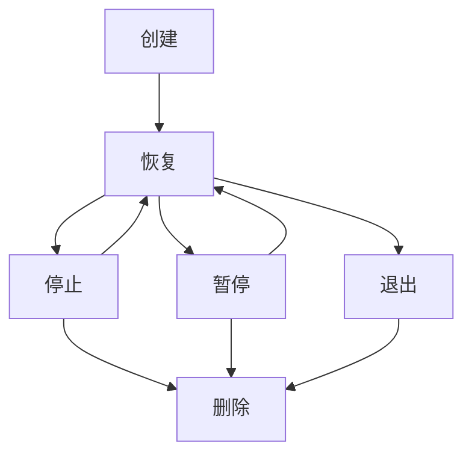

# 核心概念详解 - 为零基础初学者设计

## 🎯 文档目标

本文档为零基础初学者详细解释Docker和容器技术的核心概念。在阅读源码之前，理解这些概念会让你事半功倍。

## 📦 什么是容器？

### 生活中的比喻

想象你在搬家：
- **传统方式**：把整个房子搬到新地方（包括所有家具、电器、装修）
- **容器方式**：打包一个行李箱，到新地方后找个空房子，把行李箱里的东西摆出来

容器就像是这个"行李箱"，它包含了应用运行需要的所有东西：
- 应用程序代码
- 运行时环境（如Python、Java）
- 系统库和依赖
- 配置文件

### 为什么需要容器？

**传统部署的问题**：
```
开发者电脑： Python 3.8 + 库A + 库B
测试服务器： Python 3.6 + 库A + 库B v1.0
生产服务器： Python 3.7 + 库A v2.0 + 库B
```

**容器的解决方案**：
```
容器内： 固定的Python版本 + 固定的库版本
任何地方运行：都是完全相同的环境
```

## 🗂️ 镜像（Image）vs 容器（Container）

### 镜像（Image）
- **是什么**：一个只读的模板，类似于类的概念
- **特点**：
  - 不可变的（创建后不能修改）
  - 可以被复制和分享
  - 包含运行应用所需的所有文件
  - 有版本控制（如ubuntu:20.04, nginx:1.21）

### 容器（Container）
- **是什么**：镜像的运行实例，类似于对象的概念
- **特点**：
  - 可读写的（运行时可以修改）
  - 有生命周期（创建、运行、停止、删除）
  - 隔离的运行环境
  - 轻量级（启动快，资源占用少）

### 代码中的体现

```go
// pkg/types/image.go
type Image struct {
    ID       string      // 镜像唯一标识
    Name     string      // 镜像名称：如 "ubuntu"
    Tag      string      // 版本标签：如 "20.04"
    Layers   []string    // 文件系统层
    Config   ImageConfig // 运行配置
    // 就像一个类定义
}

// pkg/types/container.go
type Container struct {
    ID         string           // 容器唯一标识
    Name       string           // 容器名称
    ImageID    string           // 基于哪个镜像（类的引用）
    Status     ContainerStatus // 运行状态
    CreatedAt  string           // 创建时间
    // 就像一个类的实例
}
```

## 🏗️ 容器的核心技术

### 1. 命名空间（Namespaces）

**什么是命名空间**？
Linux内核提供的一种资源隔离机制，让进程看起来像在独立的系统中运行。

**生活中的比喻**：
- 就像公寓楼里的各个房间
- 每个房间都有自己的门牌号（进程ID）
- 看不到其他房间里的情况
- 但实际上都在同一个楼里（同一个操作系统）

**主要的命名空间类型**：

```go
// 在代码中我们会用到这些隔离机制
type NamespaceConfig struct {
    PID     bool // 进程隔离：每个容器有自己的进程树
    Network bool // 网络隔离：每个容器有自己的网络栈
    Mount   bool // 文件系统隔离：每个容器有自己的文件系统视图
    UTS     bool // 主机名隔离：每个容器有自己的主机名
    IPC     bool // 进程间通信隔离
    User    bool // 用户隔离：每个容器有自己的用户空间
}
```

**实际效果**：
```bash
# 在容器内运行
container$ ps aux
USER         PID %CPU %MEM    VSZ   RSS TTY      STAT START   TIME COMMAND
root           1  0.0  0.1    1000   500 ?        S    10:00   0:00 /bin/bash
root          15  0.0  0.1    2000   600 ?        S    10:01   0:00 ps aux

# 在主机上运行（同一个系统）
host$ ps aux | grep container
user      1234  0.0  0.1  100000  500 ?        S    10:00   0:00 containerd-shim
user      1235  0.0  0.1  101000  600 ?        S    10:00   0:00 /bin/bash
user      1249  0.0  0.1  102000  700 ?        S    10:01   0:00 ps aux
```

### 2. 控制组（cgroups）

**什么是cgroups**？
Linux内核提供的一种资源限制机制，可以限制进程组使用的资源量。

**生活中的比喻**：
- 就像公寓的水电表
- 每个房间都有用水用电限额
- 超过限额就会被限制或收费

**资源限制类型**：

```go
// pkg/types/container.go 中的资源配置
type ResourceConfig struct {
    CPU     float64 // CPU限制（核心数）
    Memory  int64   // 内存限制（字节）
    Disk    int64   // 磁盘限制（字节）
    Network int64   // 网络带宽限制
}

type ContainerConfig struct {
    Resources ResourceConfig `json:"resources"`
    // ...
}
```

**实际应用**：
```go
// 在容器运行时应用资源限制
func (m *Manager) applyResourceLimits(container *Container) error {
    // 限制CPU使用为0.5个核心
    if err := setCPULimit(container.ID, container.Config.Resources.CPU); err != nil {
        return err
    }

    // 限制内存使用为512MB
    if err := setMemoryLimit(container.ID, container.Config.Resources.Memory); err != nil {
        return err
    }

    return nil
}
```

### 3. 联合文件系统（Union File System）

**什么是UnionFS**：
一种分层文件系统，可以将多个目录层叠在一起，形成一个统一的视图。

**生活中的比喻**：
- 就像Photoshop的图层
- 底层是基础图片（基础镜像）
- 上层可以添加透明图层（容器层）
- 可以看到所有图层叠加的效果
- 删除上层图层不会影响底层

**在Docker中的应用**：

```go
// pkg/types/image.go 中的层定义
type Image struct {
    Layers []string `json:"layers"`
    // 层结构示例：
    // Layers[0] = "ubuntu:20.04-base"      // 基础层
    // Layers[1] = "python3.8-install"     // 运行时层
    // Layers[2] = "app-dependencies"      // 依赖层
    // Layers[3] = "application-code"      // 应用层
}
```

**优势**：
- **节省空间**：多个镜像可以共享基础层
- **快速构建**：只需要传输变化的层
- **版本控制**：可以回滚到之前的层

## 🔄 容器生命周期

### 完整的生命周期

```go
// pkg/types/container.go 中的状态定义
type ContainerStatus string

const (
    StatusCreated  ContainerStatus = "created"  // 已创建
    StatusRunning  ContainerStatus = "running"  // 运行中
    StatusStopped  ContainerStatus = "stopped"  // 已停止
    StatusPaused   ContainerStatus = "paused"   // 已暂停
    StatusRemoving ContainerStatus = "removing" // 删除中
    StatusExited   ContainerStatus = "exited"   // 已退出
)
```

### 状态转换图



### 代码实现示例

```go
// pkg/container/manager.go 中的状态管理
func (m *Manager) StartContainer(containerID string) error {
    // 1. 获取容器
    container, err := m.GetContainer(containerID)
    if err != nil {
        return err
    }

    // 2. 检查当前状态
    if container.Status == StatusRunning {
        return fmt.Errorf("container is already running")
    }

    // 3. 更新状态为运行中
    container.Status = StatusRunning
    container.UpdatedAt = time.Now().Format(time.RFC3339)

    // 4. 保存状态
    return m.store.Save(container.ID, container)
}

func (m *Manager) StopContainer(containerID string) error {
    // 1. 获取容器
    container, err := m.GetContainer(containerID)
    if err != nil {
        return err
    }

    // 2. 停止容器进程
    if err := m.stopContainerProcess(containerID); err != nil {
        return err
    }

    // 3. 更新状态为停止
    container.Status = StatusStopped
    container.UpdatedAt = time.Now().Format(time.RFC3339)

    // 4. 保存状态
    return m.store.Save(container.ID, container)
}
```

## 📁 存储系统

### 数据持久化的挑战

**问题**：容器停止后，容器内的所有数据都会丢失
**解决方案**：数据卷（Volumes）和持久化存储

### 存储类型

```go
// pkg/types/container.go 中的存储配置
type StorageConfig struct {
    Type    string            `json:"type"`    // 存储类型
    Volumes map[string]string `json:"volumes"` // 数据卷映射
    Binds   []string          `json:"binds"`   // 绑定挂载
}

type ContainerConfig struct {
    Storage StorageConfig `json:"storage"`
    // ...
}
```

**存储选项**：

1. **临时存储**（默认）
   - 随容器生命周期创建和销毁
   - 适合临时数据

2. **数据卷**（Volumes）
   - 独立于容器的持久化存储
   - 可以在容器间共享

3. **绑定挂载**（Bind Mounts）
   - 将主机目录挂载到容器内
   - 开发和调试时常用

### 代码示例

```go
// 创建容器时处理存储配置
func (m *Manager) setupStorage(container *Container) error {
    // 1. 创建临时存储层
    if err := m.createContainerLayer(container.ID); err != nil {
        return fmt.Errorf("failed to create container layer: %w", err)
    }

    // 2. 挂载数据卷
    for volumeName, volumePath := range container.Config.Storage.Volumes {
        if err := m.mountVolume(container.ID, volumeName, volumePath); err != nil {
            return fmt.Errorf("failed to mount volume %s: %w", volumeName, err)
        }
    }

    // 3. 处理绑定挂载
    for _, bindPath := range container.Config.Storage.Binds {
        if err := m.bindMount(container.ID, bindPath); err != nil {
            return fmt.Errorf("failed to bind mount %s: %w", bindPath, err)
        }
    }

    return nil
}
```

## 🌐 网络系统

### 容器网络的基本概念

**问题**：如何让容器与外界通信？
**解决方案**：虚拟网络设备

### 网络模式

```go
// pkg/types/container.go 中的网络配置
type NetworkConfig struct {
    Mode       string   `json:"mode"`       // 网络模式
    IPAddress  string   `json:"ip_address"`  // IP地址
    Ports      []Port   `json:"ports"`      // 端口映射
    DNS        []string `json:"dns"`        // DNS服务器
}

type Port struct {
    HostPort      int    `json:"host_port"`      // 主机端口
    ContainerPort int    `json:"container_port"` // 容器端口
    Protocol      string `json:"protocol"`      // 协议
}

type ContainerConfig struct {
    Network NetworkConfig `json:"network"`
    // ...
}
```

**网络模式**：

1. **Bridge模式**（默认）
   - 容器连接到虚拟网桥
   - 通过NAT访问外网
   - 最常用的模式

2. **Host模式**
   - 容器使用主机网络栈
   - 性能最好，但隔离性差

3. **None模式**
   - 容器没有网络接口
   - 完全隔离

4. **Container模式**
   - 容器共享另一个容器的网络

### 端口映射

```go
// 端口映射的实现
func (m *Manager) setupPortMapping(container *Container) error {
    for _, port := range container.Config.Network.Ports {
        // 设置iptables规则
        rule := fmt.Sprintf("PREROUTING -p %s --dport %d -j DNAT --to-destination %s:%d",
            port.Protocol, port.HostPort, container.IPAddress, port.ContainerPort)

        if err := m.addIPTablesRule(rule); err != nil {
            return fmt.Errorf("failed to add port mapping %d:%d: %w",
                port.HostPort, port.ContainerPort, err)
        }
    }
    return nil
}
```

## 🛠️ 镜像构建

### Dockerfile概念

**什么是Dockerfile**？
一个文本文件，包含构建镜像的指令。

### 构建过程

```go
// pkg/image/manager.go 中的构建逻辑
func (m *Manager) BuildImage(dockerfile string, tag string) error {
    // 1. 解析Dockerfile
    instructions, err := m.parseDockerfile(dockerfile)
    if err != nil {
        return err
    }

    // 2. 创建基础层
    baseImage, err := m.pullBaseImage(instructions[0].From)
    if err != nil {
        return err
    }

    // 3. 逐层构建
    image := baseImage
    for _, instruction := range instructions[1:] {
        switch instruction.Command {
        case "RUN":
            // 运行命令，创建新层
            layer, err := m.runCommand(instruction.Args)
            if err != nil {
                return err
            }
            image.Layers = append(image.Layers, layer.ID)

        case "COPY":
            // 复制文件，创建新层
            layer, err := m.copyFiles(instruction.Src, instruction.Dst)
            if err != nil {
                return err
            }
            image.Layers = append(image.Layers, layer.ID)

        case "ENV":
            // 设置环境变量
            image.Config.Env = append(image.Config.Env, instruction.Args)
        }
    }

    // 4. 保存镜像
    image.Tag = tag
    return m.store.Save(image.ID, image)
}
```

## 📊 镜像仓库

### 镜像仓库的作用

**为什么需要镜像仓库？**
- 镜像分享和分发
- 版本管理
- 团队协作

### 仓库操作

```go
// pkg/image/manager.go 中的仓库操作
func (m *Manager) PullImage(name, tag string) error {
    // 1. 检查本地是否已存在
    if image, err := m.GetImage(name, tag); err == nil {
        return fmt.Errorf("image %s:%s already exists", name, tag)
    }

    // 2. 连接仓库
    client, err := m.connectToRegistry()
    if err != nil {
        return err
    }

    // 3. 下载镜像元数据
    manifest, err := client.GetManifest(name, tag)
    if err != nil {
        return err
    }

    // 4. 下载各层
    for _, layer := range manifest.Layers {
        if err := m.downloadLayer(layer); err != nil {
            return err
        }
    }

    // 5. 组装镜像
    image := &Image{
        ID:    generateImageID(),
        Name:  name,
        Tag:   tag,
        Layers: manifest.Layers,
    }

    // 6. 保存到本地
    return m.store.Save(image.ID, image)
}

func (m *Manager) PushImage(name, tag string) error {
    // 1. 获取本地镜像
    image, err := m.GetImage(name, tag)
    if err != nil {
        return err
    }

    // 2. 连接仓库
    client, err := m.connectToRegistry()
    if err != nil {
        return err
    }

    // 3. 上传各层
    for _, layer := range image.Layers {
        if err := m.uploadLayer(layer); err != nil {
            return err
        }
    }

    // 4. 上传镜像清单
    manifest := m.createManifest(image)
    return client.PushManifest(name, tag, manifest)
}
```

## 🔧 容器运行时

### 什么是容器运行时？

负责创建和运行容器的底层组件，就像是容器的"引擎"。

### 运行时操作

```go
// pkg/container/manager.go 中的运行时操作
func (m *Manager) createContainerProcess(container *Container) (*os.Process, error) {
    // 1. 准备容器文件系统
    if err := m.setupFilesystem(container); err != nil {
        return nil, err
    }

    // 2. 设置资源限制
    if err := m.setupResourceLimits(container); err != nil {
        return nil, err
    }

    // 3. 设置网络
    if err := m.setupNetwork(container); err != nil {
        return nil, err
    }

    // 4. 创建进程
    cmd := exec.Command(container.Config.Command[0], container.Config.Command[1:]...)

    // 5. 设置命名空间
    cmd.SysProcAttr = &syscall.SysProcAttr{
        Cloneflags: syscall.CLONE_NEWUTS | syscall.CLONE_NEWPID |
                   syscall.CLONE_NEWNS | syscall.CLONE_NEWNET,
    }

    // 6. 启动进程
    if err := cmd.Start(); err != nil {
        return nil, err
    }

    return cmd.Process, nil
}
```

## 🎯 总结

通过理解这些核心概念，你将能够：

1. **理解容器的工作原理**：知道容器是如何实现隔离和资源限制的
2. **阅读源码更加轻松**：看到代码就能理解其背后的设计意图
3. **问题排查更加高效**：遇到问题时能够从底层原理分析
4. **扩展功能更加自信**：理解了架构后可以更好地添加新功能

### 学习建议

1. **从实践开始**：先使用Docker，再理解原理
2. **对比学习**：将传统部署和容器部署进行对比
3. **动手实验**：通过命令行工具观察容器的行为
4. **逐步深入**：从简单概念开始，逐步深入复杂的技术细节

记住，容器技术虽然看起来复杂，但其核心思想其实很简单：**打包应用及其依赖，在任何地方都能一致运行**。理解了这个核心思想，其他的技术细节就都好理解了！