# 模块依赖关系和阅读顺序详解

## 📊 完整的模块依赖图



## 🎯 推荐的阅读顺序（从易到难）

### 📚 第一阶段：基础数据层（最简单，无依赖）

#### 1. `pkg/types/` - 数据类型定义
**难度**: ⭐☆☆☆☆ (1/5)
**前置要求**: 无
**阅读时间**: 1-2小时

**为什么从这开始？**
- 这是整个系统的数据字典
- 不依赖任何其他模块
- 理解了数据结构，后面看业务逻辑就简单了

**阅读顺序**:
1. `image.go` - 理解镜像的概念
2. `container.go` - 理解容器的概念

**关键学习点**:
```go
// 学习Go的结构体定义
type Image struct {
    ID       string      `json:"id"`      // JSON标签用于序列化
    Name     string      `json:"name"`
    // ...
}

// 学习常量定义
const (
    StatusCreated ContainerStatus = "created"
    StatusRunning ContainerStatus = "running"
    StatusStopped ContainerStatus = "stopped"
)
```

---

### 📚 第二阶段：核心存储层（数据持久化）

#### 2. `pkg/store/` - 存储系统
**难度**: ⭐⭐☆☆☆ (2/5)
**前置要求**: 理解Types模块
**阅读时间**: 2-3小时

**为什么第二步？**
- 所有业务模块都依赖存储
- 相对简单，主要是文件操作
- 理解数据如何保存和读取

**阅读顺序**:
1. `store.go` - 核心存储逻辑

**关键学习点**:
```go
// 学习Go的错误处理
func (s *Store) Save(key string, value interface{}) error {
    // 1. 参数验证
    if key == "" {
        return fmt.Errorf("key cannot be empty")
    }

    // 2. 数据序列化
    data, err := json.Marshal(value)
    if err != nil {
        return fmt.Errorf("failed to marshal data: %w", err)
    }

    // 3. 文件操作
    if err := os.WriteFile(path, data, 0644); err != nil {
        return fmt.Errorf("failed to write file: %w", err)
    }

    return nil
}
```

---

### 📚 第三阶段：核心业务逻辑层

#### 3. `pkg/image/` - 镜像管理
**难度**: ⭐⭐⭐☆☆ (3/5)
**前置要求**: Store, Types
**阅读时间**: 3-4小时

**阅读顺序**:
1. `manager.go` - 镜像管理的所有操作

**关键学习点**:
```go
// 学习依赖注入
type Manager struct {
    store *store.Store
}

// 学习接口设计
func (m *Manager) PullImage(name, tag string) error {
    // 1. 参数处理
    // 2. 调用存储层
    // 3. 返回结果
}
```

#### 4. `pkg/container/` - 容器管理
**难度**: ⭐⭐⭐☆☆ (3/5)
**前置要求**: Store, Image, Types
**阅读时间**: 4-5小时

**阅读顺序**:
1. `manager.go` - 容器生命周期管理

**关键学习点**:
```go
// 学习复杂的业务逻辑
func (m *Manager) RunContainer(imageID string, config *ContainerConfig) (*Container, error) {
    // 1. 验证镜像存在
    image, err := m.imageMgr.GetImage(imageID)
    if err != nil {
        return nil, fmt.Errorf("image not found: %w", err)
    }

    // 2. 创建容器实例
    container := &Container{
        ID:        generateID(),
        ImageID:   imageID,
        Status:    StatusCreated,
        CreatedAt: time.Now().Format(time.RFC3339),
    }

    // 3. 保存到存储
    if err := m.store.Save(container.ID, container); err != nil {
        return nil, fmt.Errorf("failed to save container: %w", err)
    }

    return container, nil
}
```

---

### 📚 第四阶段：用户接口层

#### 5. `pkg/cli/` - 命令行接口
**难度**: ⭐⭐⭐⭐☆ (4/5)
**前置要求**: 所有基础模块
**阅读时间**: 3-4小时

**阅读顺序**:
1. `commands.go` - 所有CLI命令定义
2. `cluster_commands.go` - 集群相关命令

**关键学习点**:
```go
// 学习CLI框架使用
func (app *App) createImageCommands() *cli.Command {
    return &cli.Command{
        Name:  "image",
        Usage: "Manage images",
        Subcommands: []*cli.Command{
            {
                Name:    "list",
                Usage:   "List images",
                Action:  app.listImages,
            },
        },
    }
}

// 学习命令处理函数
func (app *App) listImages(c *cli.Context) error {
    // 1. 调用业务逻辑
    images, err := app.imageMgr.ListImages()
    if err != nil {
        return fmt.Errorf("failed to list images: %v", err)
    }

    // 2. 格式化输出
    for _, image := range images {
        fmt.Printf("%s\t%s\t%s\n", image.ID[:12], image.Name, image.Tag)
    }

    return nil
}
```

#### 6. `cmd/mydocker/` - 程序入口
**难度**: ⭐⭐☆☆☆ (2/5)
**前置要求**: CLI模块
**阅读时间**: 1小时

**阅读顺序**:
1. `main.go` - 程序入口点

**关键学习点**:
```go
// 学习程序启动流程
func main() {
    // 1. 创建应用实例
    app, err := cli.New()
    if err != nil {
        log.Fatal(err)
    }

    // 2. 运行应用
    if err := app.Run(os.Args); err != nil {
        log.Fatal(err)
    }
}
```

---

### 📚 第五阶段：高级功能模块（可选，按兴趣选择）

#### 7. `pkg/performance/` - 性能优化
**难度**: ⭐⭐⭐⭐☆ (4/5)
**前置要求**: 基础模块
**阅读时间**: 4-5小时

**推荐理由**: 学习性能监控和优化技术

#### 8. `pkg/network/` - 网络功能
**难度**: ⭐⭐⭐⭐☆ (4/5)
**前置要求**: 基础模块
**阅读时间**: 5-6小时

**推荐理由**: 理解容器网络原理

#### 9. `pkg/storage/` - 存储驱动
**难度**: ⭐⭐⭐⭐☆ (4/5)
**前置要求**: 基础模块
**阅读时间**: 4-5小时

**推荐理由**: 学习高级存储技术

#### 10. `pkg/cluster/` - 集群管理
**难度**: ⭐⭐⭐⭐⭐ (5/5)
**前置要求**: 所有基础模块
**阅读时间**: 8-10小时

**推荐理由**: 学习分布式系统概念，最复杂的功能

---

## 🔍 深入理解技巧

### 1. 跟随一个完整的工作流程

选择 `mydocker container run ubuntu echo "hello"` 这个命令，跟踪它的执行：

```go
// 1. main.go
func main() {
    app.Run(os.Args) // ["mydocker", "container", "run", "ubuntu", "echo", "hello"]
}

// 2. cli/commands.go
func (app *App) runContainer(c *cli.Context) error {
    imageName := c.Args().First()
    command := c.Args().Tail()

    // 调用容器管理器
    container, err := app.containerMgr.RunContainer(imageName, command)
    // ...
}

// 3. container/manager.go
func (m *Manager) RunContainer(imageID string, command []string) (*Container, error) {
    // 1. 检查镜像存在
    image, err := m.imageMgr.GetImage(imageID)

    // 2. 创建容器
    container := &Container{...}

    // 3. 保存到存储
    err = m.store.Save(container.ID, container)

    // 4. 启动容器
    go m.startContainer(container)

    return container, nil
}
```

### 2. 理解错误处理模式

```go
// 标准的错误处理模式
func doSomething() error {
    // 1. 验证输入
    if input == nil {
        return fmt.Errorf("input cannot be nil")
    }

    // 2. 调用其他函数
    result, err := someFunction()
    if err != nil {
        return fmt.Errorf("failed to do something: %w", err)
    }

    // 3. 处理结果
    if err := processResult(result); err != nil {
        return fmt.Errorf("failed to process result: %w", err)
    }

    return nil
}
```

### 3. 学习测试代码

```go
// 测试是理解代码行为的最佳方式
func TestImageManager_ListImages(t *testing.T) {
    // 1. 准备测试环境
    store := store.NewTestStore()
    manager := image.NewManager(store)

    // 2. 执行测试操作
    images, err := manager.ListImages()

    // 3. 验证结果
    assert.NoError(t, err)
    assert.Len(t, images, 0)
}
```

## 📈 学习进度检查表

### 基础阶段（必须完成）
- [ ] 理解所有数据类型定义
- [ ] 能够解释镜像和容器的区别
- [ ] 理解存储系统的工作原理
- [ ] 能够使用存储API进行数据操作

### 业务逻辑阶段（必须完成）
- [ ] 理解镜像的CRUD操作
- [ ] 理解容器的生命周期
- [ ] 能够跟踪一个完整的工作流程
- [ ] 理解模块间的依赖关系

### 接口阶段（必须完成）
- [ ] 理解CLI命令的处理流程
- [ ] 能够添加新的CLI命令
- [ ] 理解程序启动过程
- [ ] 能够独立运行和调试程序

### 高级阶段（可选）
- [ ] 理解性能优化技术
- [ ] 理解网络配置原理
- [ ] 理解存储驱动机制
- [ ] 理解集群管理概念

## 💡 学习建议

### 每天学习目标
- **第1天**: 完成Types模块
- **第2天**: 完成Store模块
- **第3-4天**: 完成Image和Container模块
- **第5天**: 完成CLI模块
- **第6天**: 运行测试，验证理解
- **第7-10天**: 尝试修改代码，添加小功能

### 实践项目
1. 添加 `mydocker version` 命令
2. 给容器添加描述字段
3. 实现容器重命名功能
4. 添加简单的日志记录
5. 编写更多的测试用例

### 遇到困难时
1. 回到基础，重新理解数据结构
2. 运行测试观察实际行为
3. 添加打印语句跟踪执行流程
4. 在社区寻求帮助

记住，这个学习路径是为你设计的，按照自己的节奏来，不要急于求成。每完成一个阶段，你都会对容器技术有更深入的理解！