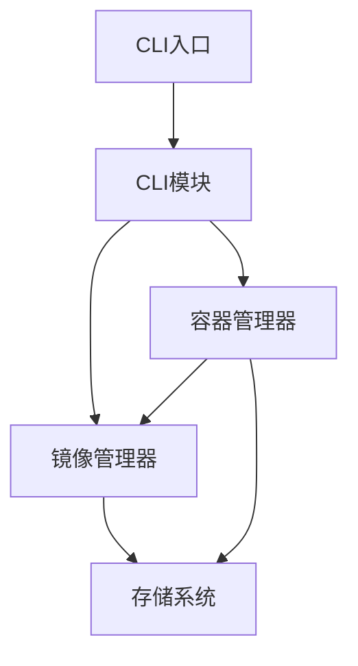

# MyDocker 源码阅读指南 - 为初学者设计

## 🎯 本指南目标

本指南专为刚开始学习容器技术和Go语言的初学者设计，帮助你逐步理解这个Docker实现项目的源码结构和工作原理。

## 📚 阅读前的准备知识

### 必需知识
- **Go语言基础**: 了解基本的Go语法、函数、结构体、接口
- **Linux基础**: 知道什么是进程、文件系统、网络
- **命令行使用**: 会使用基本的shell命令

### 推荐知识（非必需）
- Docker基本使用
- Linux命名空间和cgroups概念
- 网络基础概念

## 🗺️ 项目总体架构

```
docker-impl/
├── cmd/mydocker/          # 程序入口点 (从这里开始)
├── pkg/                   # 核心功能实现
│   ├── types/            # 数据类型定义 (第一步)
│   ├── store/            # 存储系统 (第二步)
│   ├── image/            # 镜像管理 (第三步)
│   ├── container/        # 容器管理 (第四步)
│   ├── cli/              # 命令行接口 (第五步)
│   ├── performance/      # 性能优化 (高级功能)
│   ├── network/          # 网络功能 (高级功能)
│   ├── storage/          # 存储驱动 (高级功能)
│   └── cluster/          # 集群管理 (高级功能)
└── tests/                # 测试代码
```

## 📖 推荐阅读顺序

### 阶段一：理解基础概念 (1-2天)

#### 1. 从数据类型开始 - `pkg/types/`
**为什么从这里开始？**
- 数据类型是整个系统的基础
- 理解了数据结构，才能理解业务逻辑
- 最简单，没有复杂的逻辑

**阅读文件：**
- `image.go` - 理解什么是镜像、镜像的结构
- `container.go` - 理解什么是容器、容器的生命周期

**关键概念：**
```go
// 镜像就像一个模板，包含了运行容器需要的所有文件和配置
type Image struct {
    ID       string      // 镜像唯一标识
    Name     string      // 镜像名称，如 "ubuntu"
    Tag      string      // 版本标签，如 "20.04"
    Layers   []string    // 文件系统层
    Config   ImageConfig // 运行配置
}

// 容器是镜像的运行实例
type Container struct {
    ID         string           // 容器唯一标识
    Name       string           // 容器名称
    ImageID    string           // 基于哪个镜像
    Status     ContainerStatus // 运行状态
    CreatedAt  string           // 创建时间
    Config     ContainerConfig  // 运行配置
}
```

#### 2. 理解存储系统 - `pkg/store/`
**为什么第二步？**
- 所有数据都需要持久化存储
- 理解数据如何在磁盘上保存
- 为后续模块提供基础服务

**阅读文件：**
- `store.go` - 核心存储逻辑

**关键功能：**
```go
// 存储接口，所有数据的读写都通过它
type Store struct {
    dataDir string // 数据存储目录
}

// 基本操作：保存、读取、删除、列表
func (s *Store) Save(key string, value interface{}) error
func (s *Store) Get(key string, value interface{}) error
func (s *Store) Delete(key string) error
func (s *Store) List(prefix string) ([]string, error)
```

### 阶段二：理解核心业务逻辑 (3-5天)

#### 3. 镜像管理 - `pkg/image/`
**阅读文件：**
- `manager.go` - 镜像管理的核心逻辑

**关键功能：**
```go
// 镜像管理器，负责镜像的所有操作
type Manager struct {
    store *store.Store // 使用存储系统
}

// 核心操作：
- Pull()    // 从仓库拉取镜像
- List()    // 列出本地镜像
- Remove()  // 删除镜像
- Build()   // 构建新镜像
```

#### 4. 容器管理 - `pkg/container/`
**阅读文件：**
- `manager.go` - 容器管理的核心逻辑

**关键功能：**
```go
// 容器管理器，负责容器的整个生命周期
type Manager struct {
    store      *store.Store
    imageMgr   *image.Manager
}

// 核心操作：
- Run()     // 运行新容器
- Start()   // 启动已停止的容器
- Stop()    // 停止运行中的容器
- Remove()  // 删除容器
- List()    // 列出所有容器
```

#### 5. 命令行接口 - `pkg/cli/`
**阅读文件：**
- `commands.go` - CLI命令的定义和实现

**理解命令如何工作：**
```go
// CLI应用程序结构
type App struct {
    cliApp       *cli.App       // CLI框架
    store        *store.Store   // 依赖的组件
    imageMgr     *image.Manager
    containerMgr *container.Manager
}

// 命令处理流程：
1. 解析命令行参数
2. 调用对应的处理函数
3. 处理函数调用业务逻辑
4. 返回结果给用户
```

### 阶段三：理解程序入口 (1天)

#### 6. 主程序入口 - `cmd/mydocker/`
**阅读文件：**
- `main.go` - 程序的入口点

**程序启动流程：**
```go
func main() {
    // 1. 创建应用实例
    app, err := cli.New()

    // 2. 运行应用（处理命令行参数）
    if err != nil {
        log.Fatal(err)
    }

    // 3. 执行对应的命令
    app.Run(os.Args)
}
```

### 阶段四：理解高级功能 (根据兴趣选择)

#### 7. 性能优化 - `pkg/performance/` (可选)
**关键特性：**
- 监控系统性能
- 缓存优化
- 并发处理

#### 8. 网络功能 - `pkg/network/` (可选)
**关键特性：**
- 网络配置
- DNS服务
- 端口映射

#### 9. 存储驱动 - `pkg/storage/` (可选)
**关键特性：**
- Overlay文件系统
- 卷管理
- 存储优化

#### 10. 集群管理 - `pkg/cluster/` (可选)
**关键特性：**
- 多节点管理
- 任务调度
- API服务

## 🔍 深入理解的方法

### 1. 跟随一个命令的完整执行流程

选择一个简单命令，比如 `mydocker image list`，跟踪它的执行路径：

1. **入口**: `cmd/mydocker/main.go`
2. **命令解析**: `pkg/cli/commands.go` 的 `listImages` 函数
3. **业务逻辑**: `pkg/image/manager.go` 的 `ListImages` 方法
4. **数据访问**: `pkg/store/store.go` 的存储操作
5. **返回结果**: 将数据返回给用户

### 2. 理解模块间的依赖关系



### 3. 运行和调试测试

```bash
# 运行特定模块的测试
go test ./pkg/store/
go test ./pkg/image/
go test ./pkg/container/

# 运行所有测试
go test ./...

# 查看测试覆盖率
go test -cover ./...
```

## 💡 学习建议

### 循序渐进的学习路径

1. **第1天**: 阅读数据类型，理解基本概念
2. **第2天**: 阅读存储系统，理解数据持久化
3. **第3-4天**: 阅读镜像管理，理解镜像操作
4. **第5-6天**: 阅读容器管理，理解容器生命周期
5. **第7天**: 阅读CLI模块，理解命令处理流程
6. **第8天**: 运行测试，验证理解
7. **第9-10天**: 尝试修改代码，添加小功能

### 实践练习

1. **添加新的CLI命令**: 比如添加 `mydocker version`
2. **修改数据结构**: 给容器添加新字段
3. **实现简单功能**: 比如容器重命名
4. **编写测试**: 为新功能添加测试

### 常见问题解答

**Q: 为什么要先读数据类型？**
A: 数据类型是整个系统的骨架，理解了数据结构，才能理解业务逻辑。

**Q: 代码看不懂怎么办？**
A:
- 先看注释和文档
- 运行测试观察行为
- 打印日志查看执行流程
- 使用调试器单步执行

**Q: 如何验证自己的理解？**
A:
- 运行现有测试
- 添加打印语句观察输出
- 修改代码看结果是否符合预期
- 尝试解释代码给别人听

**Q: 需要掌握Go的高级特性吗？**
A: 不需要。这个项目主要使用Go的基础特性，掌握接口、结构体、函数就够了。

## 📚 扩展阅读

### 相关技术文档
- [Go语言官方文档](https://golang.org/doc/)
- [Docker概念解释](https://docs.docker.com/get-started/overview/)
- [Linux命名空间介绍](https://man7.org/linux/man-pages/man7/namespaces.7.html)

### 学习资源
- [Go by Example](https://gobyexample.com/)
- [Docker入门教程](https://docker-curriculum.com/)
- [Linux容器基础](https://linuxcontainers.org/)

---

## 🎉 总结

这个Docker实现虽然简化，但包含了容器技术的核心概念。通过按照这个指南循序渐进地学习，你将能够：

1. 理解容器技术的基本原理
2. 学习Go语言的实战应用
3. 掌握模块化软件设计
4. 培养阅读大型项目源码的能力

记住，学习是一个渐进的过程。遇到不懂的地方很正常，多看、多试、多问，你一定能够掌握这个项目的精髓！

---

**提示**: 如果你在阅读过程中遇到问题，可以：
1. 查看相关代码的注释
2. 运行测试观察行为
3. 在社区寻求帮助
4. 暂时跳过，继续后面的内容

祝你学习愉快！🚀